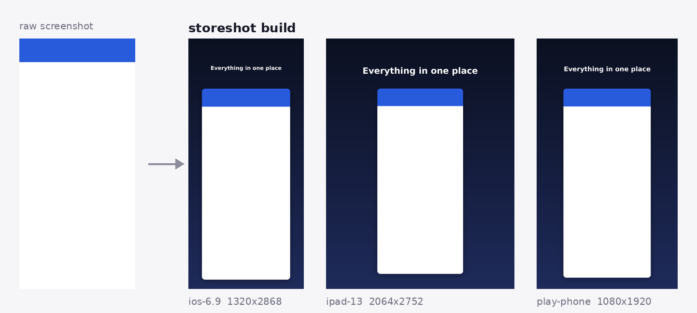

# storeshot

Turn raw device screenshots into App Store and Google Play ready images, from one config file.

Every release you take the same screenshots, then spend an hour resizing them, adding backgrounds and captions, and checking each store's pixel requirements. `storeshot` does that part in one command, and puts the result in version control where it belongs.



## Install

```bash
pip install storeshot
```

## Quickstart

```bash
storeshot init            # writes storeshot.yaml
# drop your raw screenshots into ./raw
storeshot build           # writes ./out
```

Output is one folder per target:

```
out/
├── ios-6.9/      01-home.png  02-search.png
├── ipad-13/      01-home.png  02-search.png
└── play-phone/   01-home.png  02-search.png
```

## Configuration

```yaml
input: raw
output: out
format: png          # png or jpg

targets:
  - ios-6.9          # required by the App Store for iPhone
  - ipad-13          # required by the App Store for iPad
  - play-phone
  - play-feature     # 1024x500 banner, no screenshot inside

style:
  background: ["#0B1020", "#1E2A5A"]   # one color = solid, two or more = gradient
  caption_color: "#FFFFFF"
  padding: 0.08         # side padding, fraction of width
  caption_area: 0.20    # top band reserved for the caption
  corner_radius: 0.035  # device corner rounding, fraction of width
  shadow: true
  font: /path/to/YourFont.ttf   # optional, falls back to a system font

screens:
  - file: 01-home.png
    caption: "Everything in one place"
  - file: 02-search.png
    caption: "Find it instantly"

feature_caption: "Your tagline here"
```

Every `style` value is optional. Fractions are relative to the output canvas, so one style works across every target size.

## Targets

```bash
storeshot presets
```

| Target | Size | Notes |
| --- | --- | --- |
| `ios-6.9` | 1320 x 2868 | Apple requires this for iPhone apps |
| `ios-6.9-alt` | 1290 x 2796 | also accepted for the same devices |
| `ios-6.5` | 1284 x 2778 | |
| `ios-6.3` | 1179 x 2556 | |
| `ios-6.1` | 1170 x 2532 | |
| `ios-5.5` | 1242 x 2208 | |
| `ipad-13` | 2064 x 2752 | Apple requires this for iPad apps |
| `ipad-12.9` | 2048 x 2732 | |
| `ipad-11` | 1668 x 2388 | |
| `play-phone` | 1080 x 1920 | |
| `play-tablet-7` | 1200 x 1920 | |
| `play-tablet-10` | 1600 x 2560 | |
| `play-feature` | 1024 x 500 | feature graphic, caption only |

Stores change these from time to time. You do not have to wait for a release:

```yaml
custom_targets:
  ios-next: [1320, 2868]
targets:
  - ios-next
```

Current requirements:
[Apple](https://developer.apple.com/help/app-store-connect/reference/screenshot-specifications/) ·
[Google Play](https://support.google.com/googleplay/android-developer/answer/9866151)

## Notes

- Output is always written without an alpha channel, because both stores reject transparency.
- Screenshots are fitted, never cropped or stretched, so a phone screenshot on an iPad canvas is letterboxed onto the background rather than distorted.
- `storeshot build` fails before writing anything if a file listed in the config is missing, so a half-finished set never reaches a store listing.

## Development

```bash
git clone https://github.com/sonayyarayici/storeshot
cd storeshot
pip install -e ".[dev]"
pytest
```

## License

MIT
